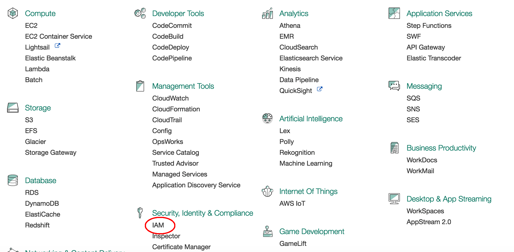
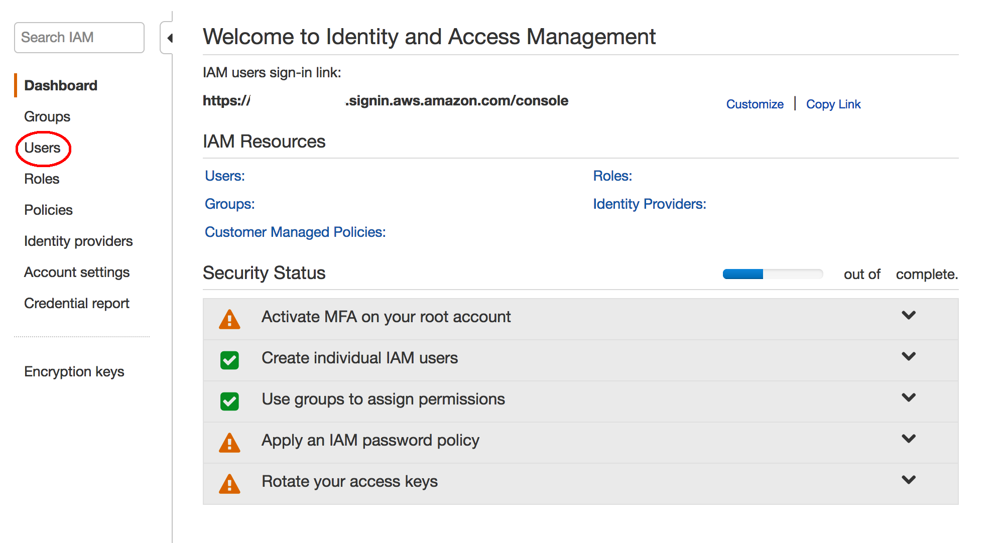
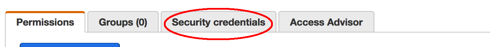
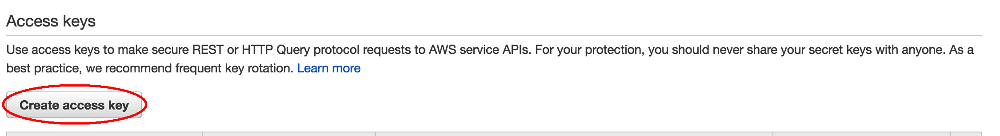

- From the console, click "Services" on the left-upper corner

- Click "IAM"

- Select "Users" from the left pannel

- Select your user and click "Security credentials"

- Click "Create access key" and save the generated key pairs

